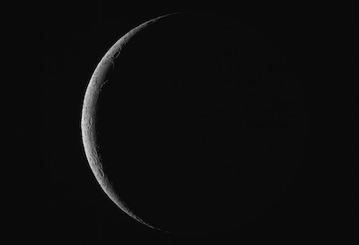

# The Cosmos: A Survey of Modern Astronomy

* Brian Hill [home page](/)

## Syllabus

* [Syllabus](./AstronomySyllabusWithDailySchedules.pdf)

## Astrophotography Projects

### Lucia Pizarro

[Wild Duck Cluster](./projects/WildDuckCluster.html) (together, the two images are 18 megabytes and the linked page will take considerable time to load)

### Chen Li

[Two-Day-Old Moon](./projects/TwoDayOldMoon.html) (together, the two images are 2 megabytes and the linked page may take some time to load)

### Alice Owen and Declan Rexer

[Veil Nebula](./projects/VeilNebula.html) (together, the two images are 19 megabytes and the linked page will take considerable time to load)

