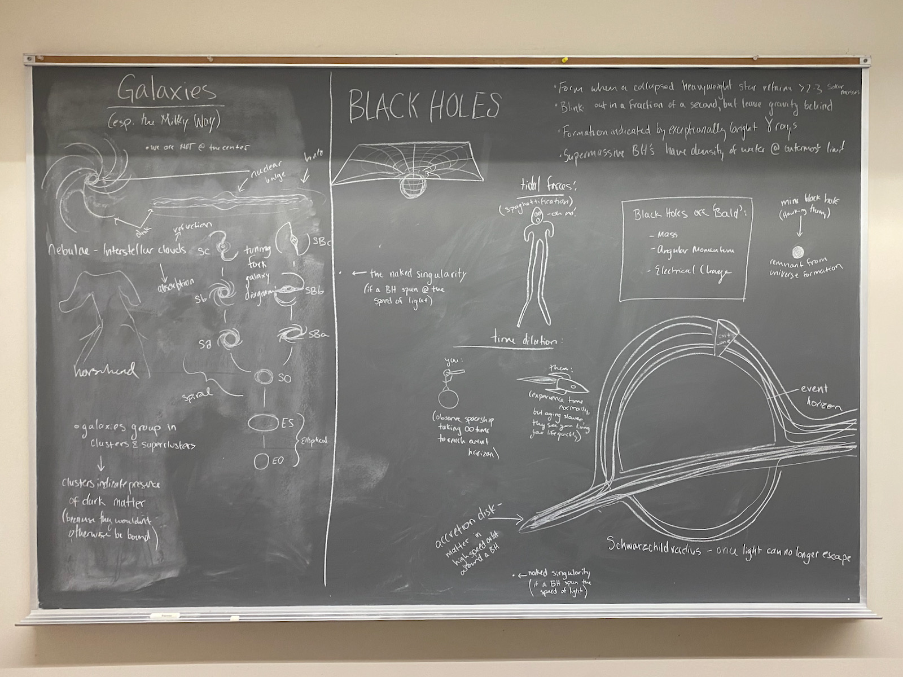

# The Cosmos: A Survey of Modern Astronomy

* Brian Hill [home page](/)

## Syllabus

* [Syllabus](./AstronomySyllabus.pdf)

## Daily Schedules (Details Added Retrospectively)

* [Daily Schedule Term 5](./daily_schedule_term_5.html)
* [Daily Schedule Term 6](./daily_schedule_term_6.html)

## Course Feedback and Suggestions

* [First Day Feedback](./first_day_feedback.html)

## Study Session for the Third (Final) Midterm

Alice's notes:

