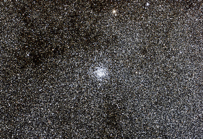
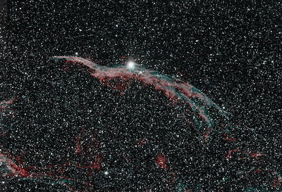

# The Cosmos: A Survey of Modern Astronomy

* Brian Hill [home page](/)

## Syllabus

* [Syllabus](./AstronomySyllabus.pdf)

## Daily Schedules

* [Daily Schedule Term 5](./daily_schedule_term_5.html)
* [Daily Schedule Term 6](./daily_schedule_term_6.html)

## Projects

Links lead to projects pages with larger images.

### Lucia Pizarro

[Wild Duck Cluster](./projects/WildDuckCluster.html) (together, the two images are about 20 megabytes and this page will take considerable time to load)

### Chen Li

[Two-Day-Old Moon](./projects/TwoDayOldMoon.html) (together, the two images are about 2 megabytes and the linked page will some take time to load)

### Alice Owen and Declan Rexer

[Veil Nebula](./projects/VeilNebula.html) (together, the two images are about 20 megabytes and this page will take considerable time to load)

