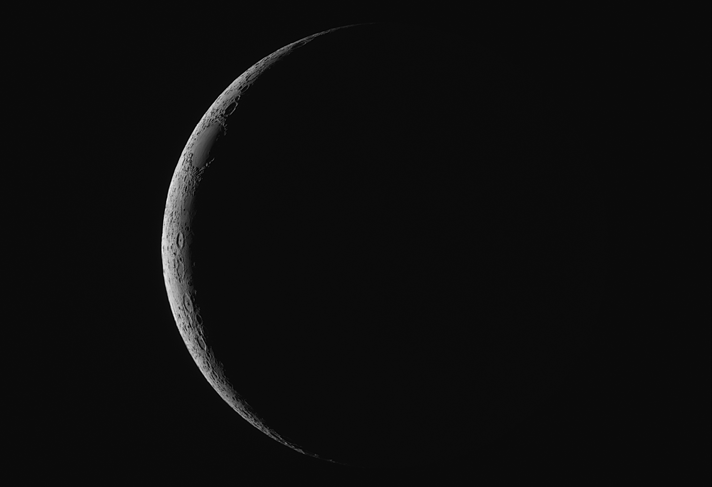

# Observational Astronomy Projects

## Chen Li

Two-Day Old Moon:

May 26 Lunar Eclipse:

The above is a monochrome photo tinted to roughly match the observed color during the eclipse.

## Lucia Pizarro

Wild Duck Open Cluster:

Detail:

## Alice Owen and Declan Rexer

Western Veil Nebula:

Detail:

